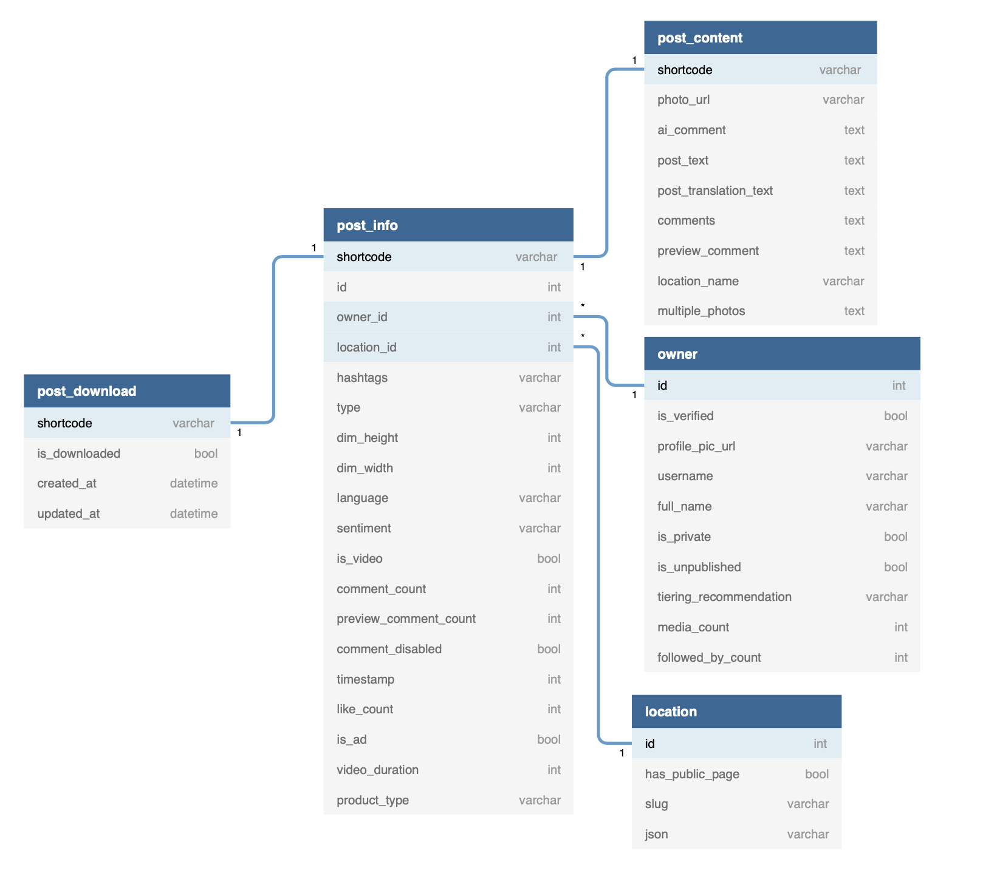

# CoronaGram
Data Mining Project as part of an ITC Data Science course 

Our program scrap instagram posts from Instagram hashtag pages

the program works in 3 steps:
1. Connection to a hashtag page, scrapping a collection post "shortcodes" and inserting them into an SQL DB
2. Collecting shortcodes that were inserted into the DB is step 1, converting them into post urls and scrape of post data
3. (optional) Enrichment database by analysing post texts with an API for detection of language, translation and 
   sentiment analysis <br> to detect if the post was either positive, negative or neutral


the separation into 3 steps allows a modular workflow by which the user can choose how many urls to collect 
how many posts to scrap and how much if at all to enrich data set with the API

<br><br>

### Graphical Abstract


Usage
=====

basic usage:
```
python coronagram.py corona misterLovaLova 12345678 
```
#### Positional arguments:

|          | Description                          |
|----------|--------------------------------------|
| tag      | Instagram #hashtag page for scraping |
| name     | Instagram user name                  |
| password | Instagram password                   |


#### Optional arguments:

| Short | Long              | Description                                                                                 | Default             | comments                                                                                                                      |
|-------|-------------------|---------------------------------------------------------------------------------------------|---------------------|-------------------------------------------------------------------------------------------------------------------------------|
| -h    | --help            | show this help message and exit                                                             |                     |                                                                                                                               |
| -lu   | --url_limit       | maximum urls to scrape                                                                      | inf                 | if '0' is chosen program will perform only post scraping step from shortcodes inserted to the SQL DB                          |
| -lp   | --post_limit      | maximum posts to scrape                                                                     | inf                 |                                                                                                                               |
| -b    | --browser         | browser choice to be used by selenium                                                       | CHROME              | supported browsers: CHROME or FIREFOX                                                                                         |
| -e    | --executable      | a path to the driver executable file                                                        | None                | If none is given it will be assumed that the driver was added and available as an OS environment variable                     |
| -d    | --db_batch        | maximum number of records to insert and commit each time                                    | 50                  |                                                                                                                               |
| -fc   | --from_code       | url shortcode to start scraping from                                                        | None                |                                                                                                                               |
| -sc   | --stop_code       | url shortcode that when reach will stop scrapping                                           | None                |                                                                                                                               |
| -i    | --implicit_wait   | implicit wait time for webdriver in seconds                                                 | 50                  |                                                                                                                               |
| -o    | --driver_options  | java script optional arguments that will be injected to browser with selenium webdriver API | \['--headless']     | can be chosen multiple times                                                                                                  |
| -mn   | --min_scroll_wait | minimum number of seconds to wait after each scroll                                         |                     |                                                                                                                               |
| -mx   | --max_scroll_wait | maximum number of seconds to wait after each scroll                                         |                     |                                                                                                                               |
| -hd   | --headed_mode     | running in headed mode (graphical browser)                                                  | False               |                                                                                                                               |
| -en   | --enrich          | maximum number of API enrichment tasks                                                      | 0                   | API enrichment includes detection of post language, translation, and analysis of sentiment ( positive, negative or neutral)   |
| -p    | --proxy           | using a proxy server for scrapping                                                          |                     | 

### DataBase ERD




### Notes

- This program used selenium library for scrolling on page due to the dynamic properties of instagram hashtag pages. 
  Selenium headless option permits limiting usage of graphical resources.
Selenium library permits working with the browser installed on
the computer (Chrome or Firefox).
- In case any browser is defined as default browser,
you have to define a path to it. If it is set, the driver will use the one defined in
OS environment variable
- database enrichment and use of proxy server requires keys and server IP respectively. In case these abilities are 
  required please make the necessary changes in the hidden configuration file 

### Dependencies
```
beautifulsoup4==4.9.3
bs4==0.0.1
certifi==2020.12.5
numpy==1.19.4
pandas==1.1.5
python-dateutil==2.8.1
pytz==2020.4
regex==0.1
selenium==3.141.0
six==1.15.0
soupsieve==2.0.1
requests==2.25.0
```

## Authors

* **Yair Stemmer** and **Yoav Wigelman**
